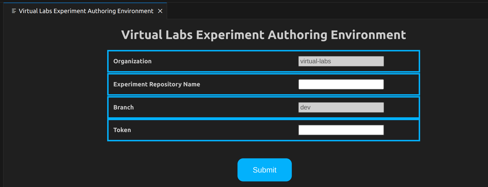

# Virtual Labs Experiment Authoring Web Extension- Help

## Introduction
The Virtual Labs extension is developed for authoring Virtual Labs experiments in a strealined manner. This lightweight extension operates fully within the browser, facilitating experiment development without the need for additional downloads.

Click [here](#developer-support) for developer support.

## Prerequisities
To make use of the extension, the following is required:

- Github account  
- Stable, high-speed internet connection

## Getting started- setup
1. Install the extension on vscode.dev from the Visual Studio Code Marketplace by searching for "Virtual Labs".

2. Click on the extension icon in the left panel

3. You will see the following list of options. 
    - [Initialize Experiment](#option-1-initialise-experiment)
    - [Save progress](#option-2-save-progress)
    - [Validate](#option-3-validate)
    - [View Current Experiment](#option-4-view-experiment)
    - [Submit for Review](#option-5--submit-for-review)
    - [Help](#option-6---help)
    - [Show Previous Validation Logs](#show-previous-validation-logs)
    - [Show Previous Build Logs](#show-previous-build-logs)

Note: For using some of these options, you may be asked to log in to GitHub if not already done so. 

## Log in 
You may either be asked via a pop-up window or you can see a blue notification appear on the accounts logo on the left hand panel.

### Incase of popup

1. Click Allow

    This may redirect you to another tab or open a window for you to sign in.

    

2.  You must input your credentials accordingly 

### Incase of notification 

1. Click on the Accounts logo
2. Click on the 'Sign in to ... '

    This may redirect you to another tab or open a window for you to sign in.
3.  You must input the credentials accordingly 

## Experiment Authoring

### Option 1: Initialize Experiment

#### This step must be done first to start working on the extension

By clicking on this you will be prompted to enter: 
- Experiment Repository Name: with the name of the experiment repository which you want to initialize

- Token: Should contain your personal access token

Clicking on Submit will open that experiment on the dev branch. Do not atttempt to change this.

This step ususually requires a [login via pop-up](#incase-of-popup).

For more details, view the [Login section](#log-in)

### Option 2: Save progress

Saves your progress on dev branch. This is so that any changes made to the experiment is stored persistently across all browser environements and machines. 

This window can be closed after progress is saved.

### Option 3: Validate

#### For validation on the changes you have made, you must run [Save progress](#option-2-save-progress) first

This option validates the code with eslint and also validates the experiment descriptor based on a schema.

The status of validate is continously updated in dialogue boxes in the bottom left, for example, 'Validation in progress'

If validation process completes successfully, the logs will be displayed in a panel called validation logs.  

### Option 4: View Current Experiment

This option provides you a link to view the experiment, including any changes you have made to the codebase. 

#### For viewing experiment with any changes you have made recently, you must run [Save progress](#option-2-save-progress) first

Like [Validate](#option-3-validate), this too informs you of current status of experiment as the experiment is built before you can view it.

Once the build is complete and successful, the logs will be displayed in a panel called build logs.     

And also pop-up will ask you if you want to open an external website in new tab.

Click 'OPEN' to view the current experiment in a new window tab. 

Alternatively, you can copy the link and paste it in a browser. 

### Option 5- Submit for Review 

Raises a pull request to the main branch of the experiment repository.
- Pull Request title - Here you have to enter the title of your pull request.
- Description - Here you can enter a short message describing the summary of the pull request you have created.

### Option 6 - Help
Explains how to to operate and use the extension. 

### Show Previous Validation Logs
This option allows you to view the logs of the previous validation process. If there were errors or warnings during that session they will be displayed here.

### Show Previous Build Logs
This option allows you to view the logs of the previous build process. If there were errors or warnings during that session they will be displayed here.

## Developer Support
If you face any difficulty in using this extension or find any bug then you can perform the following steps
1. Take a screenshot of the bug you encountered or the problem you got.
2. Explain in brief the steps you performed before encountering the bug/problem and attach a screenshot of the same.
3. Email us at dev-support@vlabs.ac.in.