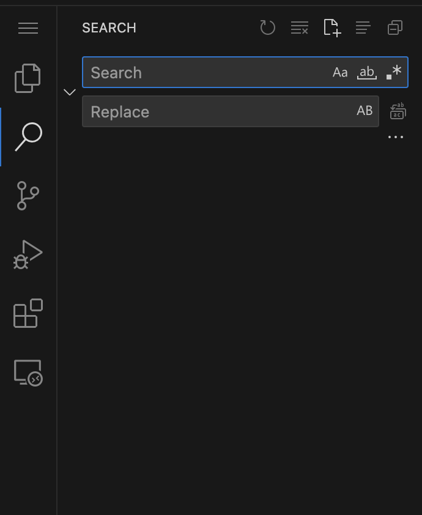
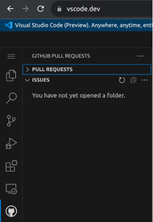

# Conversion to a web-extension

|  | Github.dev | vscode.dev | GitHub Codespaces |
| --- | --- | --- | --- |
| Overview | Web-based development environment (Web-based IDE) | Web-based development environment (Web-based IDE) | Cloud-based development environment |
| Purpose | Provide a lightweight code editing experience directly within the browser | Provide a lightweight code editing experience directly within the browser | Create fully customisable development environments in the cloud, eliminating the need for local setup and configuration. |
| Supported/ Integrated repositories | Github repositories (change URL of any repository from http://github.com to http://GitHub.dev- it will directly open repo for you) | Github repositories (append 'vscode.dev/' to the start of the GitHub repo URL); Azure repositories (same but for Azure repositories | Github repositories  |
| Terminal/ code run abilities | No | No | Yes (includes terminal and functionality to run, compile debug) |
| Sign in | Required | Not required. However options available to sign in with both GitHub account or Microsoft account. However it facilitates extra functionality described below | Required |
| Setup | No explicit set up required | No explicit set up required | Set up required- on the backend a virtual machine is set up for running code- process completely done by Github (not on user or developer end) |
| Pricing  | Free | Free | Freemium model as of date of writing:. Base free plan - 15 GB-month, 120 core course per month (may be blocked once exceeded) |

## Supporting Links and Further information

### Difference between [vscode.dev](http://vscode.dev) and [github.dev](http://github.dev)

- There appears to be very little difference in actual functionality of [GitHub.dev](http://GitHub.dev) and [vscode.dev](http://vscode.dev)
- Both are essentially meant as lightweight code editors requiring minimal signup and allowing only access to code without running and debugging capabilities
- However, [github.dev](http://github.dev) is more deeply integrated into GitHub
This is default sidebar panel of github.dev. As you can see, upon signing it directly allows you to view your recent pull requests, push requests for a repository.
    
    
    

- VS code is not made explicitly to work with [GitHub.dev](http://GitHub.dev) and supports both GitHub and azure repositories. However, it supports almost all the functionality that GitHub.dev does- either directly or via means of supported extensions.
    - For example this is  default **sidebar of** [vscode.dev](http://vscode.dev) (no sign in or extensions loaded)
    
    
    
    - This is after downloading the extension: [GitHub Pull requests](https://marketplace.visualstudio.com/items?itemName=GitHub.vscode-pull-request-github)
        
        You can see they are almost identical
        
        
        
- For the purpose of our extension, [GitHub.dev](http://GitHub.dev) doesn't appear to provide any significant advantages over [vscode.dev](http://vscode.dev).
    - After opening a repository via any means (including **clicking on a button** like we are doing in our current extension during initialisation,  via searching buttons, or via URL modifications), the functionality offered by the two are almost identical
    - Both don't allow code running- to run code you are directed to local VS code or Codespaces
- In fact, VS Code web doesn't require signup to open. Github requires to open it and download the extension only. Depending on requirements, this might be more of an advantage
- The core reason why it doesn't matter whether we choose VS code dev or GitHub dev is because the choice is arbitrary. Extensions that run on one appear to be able to run on the other.
    
    [https://docs.github.com/en/codespaces/the-githubdev-web-based-editor#using-extensions](https://docs.github.com/en/codespaces/the-githubdev-web-based-editor#using-extensions)
    
    Note: our current alpha version appears to not work directly as we specified it to run in vscode web version >1.86, however [github.dev](http://github.dev) requires version 1.85.2. So to enable it to run, we need a simple change in one line of a json file (and maybe some dependencies).
    

### Codespaces

- Codespaces has compute power allowing code to be run. It is accessed via a browser but makes use on the backend a virtual machine that gives it all its powerful functionality and the ability to run almost all extensions, not just ones built specifically for the web.
    
    [https://docs.github.com/en/codespaces/getting-started/deep-dive#personalizing-your-codespace-with-extensions-or-plugins](https://docs.github.com/en/codespaces/getting-started/deep-dive#personalizing-your-codespace-with-extensions-or-plugins)
    
- In fact, the existing plugin of Virtual Labs works directly on Codespaces
- However, Codespaces is currently running under a freemium model. As of currently it gives a reasonable amount of space and time, which equates to equivalently 2 hours/day. However this varies and the pricing model is complicated, using a GB-month unit of storage measurement.
- Pricing- GitHub Codespaces
    
    [https://docs.github.com/en/billing/managing-billing-for-github-codespaces/about-billing-for-github-codespaces](https://docs.github.com/en/billing/managing-billing-for-github-codespaces/about-billing-for-github-codespaces)
    
- Considering Virtual Labs large user base:
    - As Virtual labs has both those users that may be more technically proficient and may already be using codespaces
    - As well as those who are not tech savvy and will not be able to understand how to close/deactive their active codespaces if necessary to prevent their codespaces from being considered as active and then blocking them from further using once limit has been exceeded
    
    it may not be the most viable option
    
- However, may look using some specific functionality (eg: redirection to codespaces) for the same.
